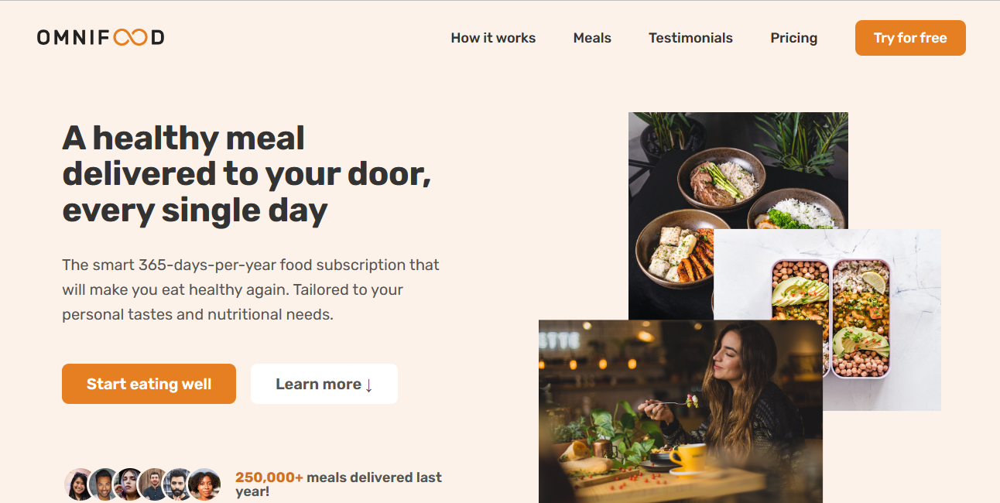

# Key Features

---

Having created the website from scratch, I learned how to create and implement features that I'm likely to use in my future websites over and over again. Here are some of the key features and topics that I worked on:

- Hamburger menu that appears on tablet-sized screens and smaller
- Smooth scrolling whenever any navigation (header and footer) are clicked
- Tested website on different browsers & had to style the select input so that it appears the same on all(Not really) browsers/devices
- Fully responsive thanks to media queries ✨
- Utilized grid, flexbox and absolute positioning.

## Header and Hero Section

